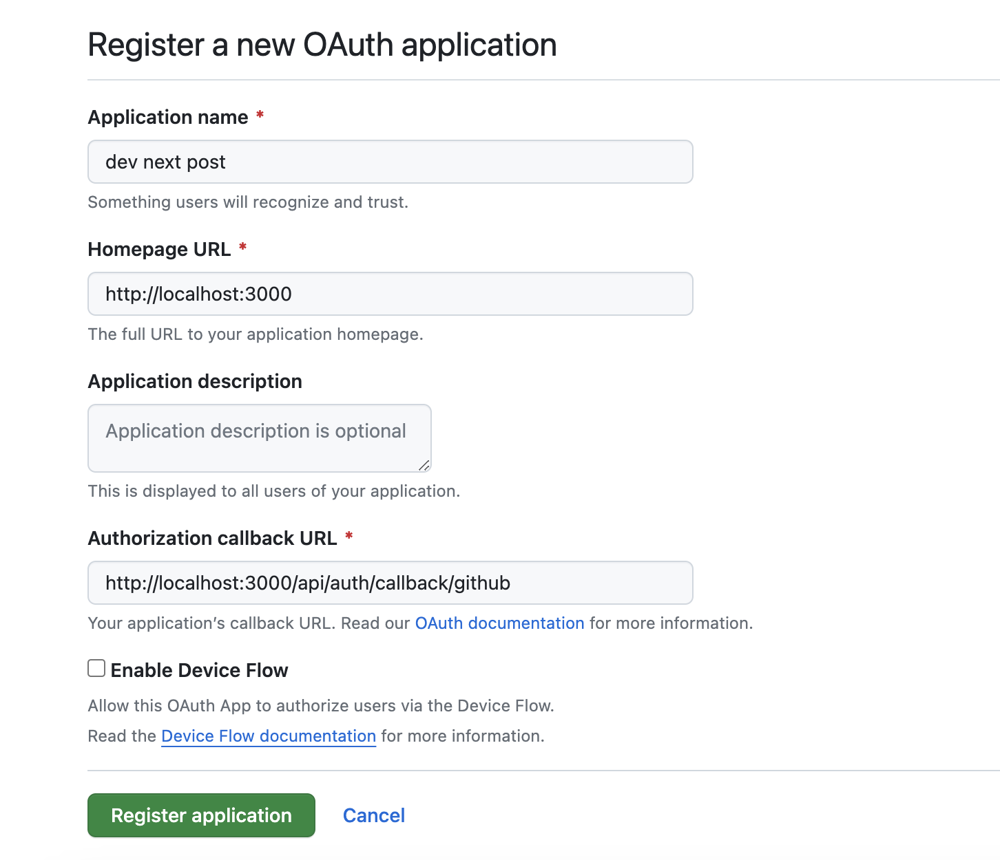

### Project up

```bash
    # install all packages
    npm ci
    # Prisma setup (run only once if file `prisma/schema.prisma` does not exist)
    npx prisma init --datasource-provider sqlite

    # create/apply migration -> generate the dev.db file
    npx prisma migrate dev

    # create the env file from sample. will fill in the value later
    cp .env.local.sample .env.local
```

### setup Github oauth

1. visit https://github.com/settings/applications/new
2. Generate a new oAuth with the following setting 
3. Copy the `Client ID` and place it in env var `GITHUB_CLIENT_ID` in `.env.local` file
4. Copy the `Client Secret` and place it in env var `GITHUB_CLIENT_SECRET` in `.env.local` file
